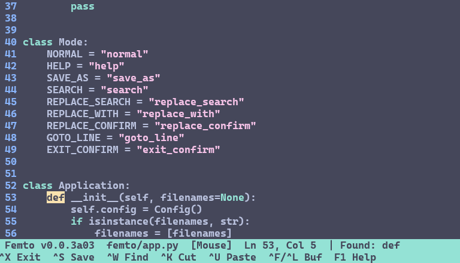

# Femto v0.0.2
     
Femto is a tiny, nano-style terminal text editor written in **pure Python**.
It ships with zero runtime dependencies on POSIX system (standard-library `curses` only) and automatically pulls `windows-curses` on Windows.

Femto supports multi-buffer editing, soft line wrapping, syntax highlighting, regex search & replace, mouse support, and is fully Unicode (CJK/Emoji) aware.

<p align="center">
	
	<br>
	<em>Femto v0.0.3: Featuring the F1 help screen, stateful Python docstring highlighting, word-boundary wrapping, and multi-match search overlays.</em>
</p>

## Install

```bash
# From PyPI (Recommended)
pipx install femto-editor
# or
pip install femto-editor

# From source
git clone https://github.com/codewithzaqar/femto.git
cd femto
pip install .
```

After installation, the `femto` command is available globally.

## Usage
```bash
femto [file ...]        # open one or multiple files
femto --line-numbers a.py x.py
femto --tab-size 2 --regex x.py
femto --version
```

## Keybindings

Press **F1** in normal editing mode to open read-only help. Use **Up/Down**, **PgUp/PgDn**, or **Home/End** to scroll; **Esc** or **q** returns to editing without changing the document. Bindings below are grouped by the context in which they work.

The tables and help share `KEYBINDINGS` in `femto/help.py`. When changing shortcuts, update that catalog and run `python -m femto.help` to regenerate the tables between the markers. The test suite checks that these tables stay in sync and exercises documented keys against the real input handlers. F1 is ignored in prompts and confirmations.

<!-- KEYBINDINGS:START -->
### Help (editing only)

| Key | Action |
|---|---|
| `F1` | Open read-only help; Esc or q returns to editing |

### Terminal (outside help)

| Key | Action |
|---|---|
| `Ctrl+C` | Interrupt and exit without save confirmation |

### File and buffers (editing)

| Key | Action |
|---|---|
| `Ctrl+X` | Exit; asks to save modified buffers |
| `Ctrl+S` | Save; Save As if unnamed |
| `Ctrl+F / Ctrl+L` | Next / previous buffer |

### Navigation (editing)

| Key | Action |
|---|---|
| `Arrows` | Move cursor |
| `Ctrl+Left / Ctrl+Right` | Previous / next word |
| `Shift+Left / Shift+Right` | Previous / next word |
| `Home / Ctrl+A` | Line start |
| `End / Ctrl+E` | Line end |
| `PgUp / PgDn` | Move cursor one page up / down |
| `Ctrl+T` | Go to line |

### Editing

| Key | Action |
|---|---|
| `Enter` | Insert newline |
| `Tab` | Insert indentation at cursor |
| `Shift+Tab` | Remove leading indentation from current line |
| `Backspace / Ctrl+H` | Delete before cursor; join at line start |
| `Delete` | Delete at cursor; join at line end |
| `Ctrl+Z / Ctrl+Y` | Undo / redo |

### Clipboard and selection (editing)

| Key | Action |
|---|---|
| `Ctrl+B` | Set / clear selection mark; move cursor to select |
| `Ctrl+K` | Cut selection, or current line if selection is empty |
| `Ctrl+P` | Copy selection, or current line if selection is empty |
| `Ctrl+U` | Paste internal clipboard |

### Search and replace (editing)

| Key | Action |
|---|---|
| `Ctrl+W` | Open search; Enter finds next (wraps at end of buffer) |
| `Ctrl+\` | Replace: search term, replacement, then confirmation |

### View and mouse (editing)

| Key | Action |
|---|---|
| `Ctrl+N` | Toggle line numbers |
| `Ctrl+D` | Toggle mouse support |
| `Mouse click` | Move cursor to clicked position (mouse enabled) |
| `Mouse wheel` | Move cursor three lines up / down (mouse enabled) |

### Prompts (Save As, Search, Replace, Go To Line)

| Key | Action |
|---|---|
| `Enter` | Confirm current prompt |
| `Ctrl+G / Esc` | Cancel prompt |
| `Left / Right` | Move prompt cursor |
| `Home / End` | Start / end of prompt text |
| `Backspace / Ctrl+H` | Delete before prompt cursor |
| `Delete` | Delete at prompt cursor |

### Search options (Search and Replace search prompts only)

| Key | Action |
|---|---|
| `Ctrl+O` | Toggle case-insensitive search |
| `Ctrl+R` | Toggle regular expressions |

### Replace confirmation

| Key | Action |
|---|---|
| `Y / N / A` | Replace current match / skip match / replace all |
| `C / Ctrl+G / Esc` | Cancel remaining replacements |

### Exit confirmation

| Key | Action |
|---|---|
| `Y / N` | Save modified buffers and exit / exit without saving |
| `C / Ctrl+G / Esc` | Cancel exit |

### Help navigation (help only)

| Key | Action |
|---|---|
| `Esc / q` | Close help and return to editing |
| `Up / Down` | Scroll one help row |
| `PgUp / PgDn` | Scroll one help page |
| `Home / End` | First / last help page |
<!-- KEYBINDINGS:END -->

## Configuration (`~/.femtorc` or `./.femtorc`)

Femto is highly customizable via a simple `key = value` configuration file.

```ini
# Indentation
tab_size = 4

# Viewport
smooth_scroll_margin = 3
soft_wrap = true
show_line_numbers = false
syntax_highlight = true

# Search
ignore_case = false
regex_search = false

# Editing
auto_indent = true
system_clipboard = false

# Wrapping
wrap_at_word = true

# Input & I/O
mouse = false
make_backup = false
# auto keeps the ending detected on load (LF for new files); lf or crlf forces it
line_ending = auto
final_newline = true  # ensure POSIX trailing newline
```

## Running the tests

Femto includes a comprehensive `unittest` regression suite that runs headlessely (no terminal required).

```bash
python -m unittest discover -s tests -v
```

## Building a release

```bash
pip install build twine
python -m build          # creates dist/femto_editor-0.0.1-*.whl
python -m twine upload dist/* # publish to PyPI
```

## Star History

<a href="https://www.star-history.com/?repos=codewithzaqar%2Ffemto&type=date&legend=top-left">
 <picture>
   <source media="(prefers-color-scheme: dark)" srcset="https://api.star-history.com/chart?repos=codewithzaqar/femto&type=date&theme=dark&legend=top-left" />
   <source media="(prefers-color-scheme: light)" srcset="https://api.star-history.com/chart?repos=codewithzaqar/femto&type=date&legend=top-left" />
   
 </picture>
</a>

## License

MIT - see [LICENSE](LICENSE).